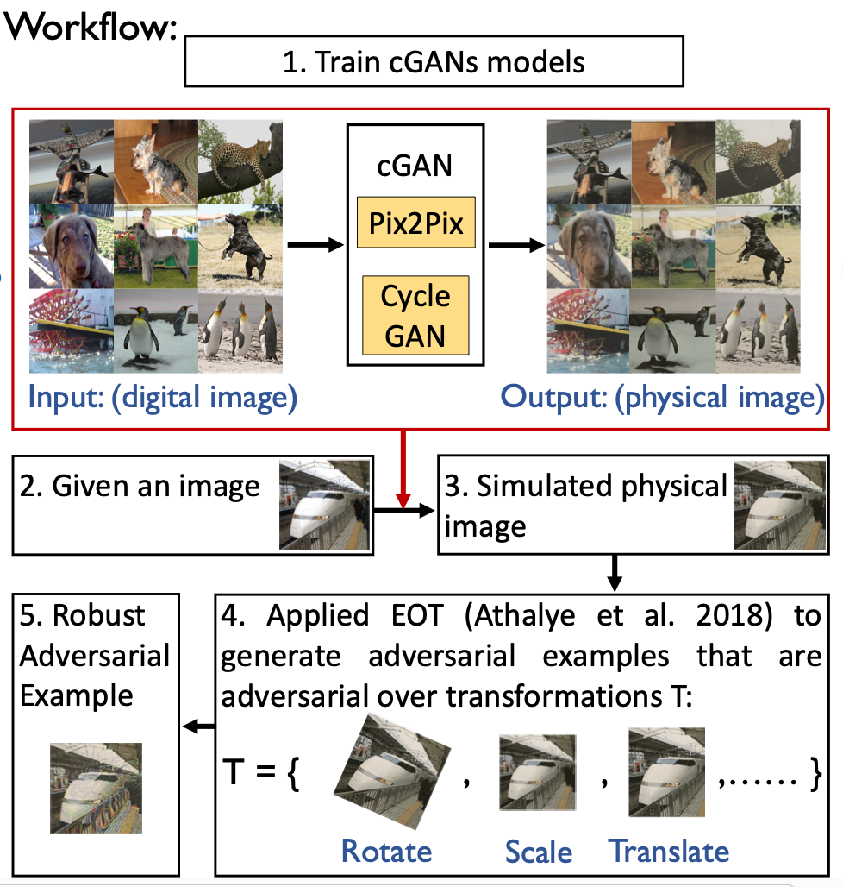

# Connecting the Digital and Physical World: Improving the Robustness of Adversarial Attacks (AAAI 2019)

This is the research code for the paper:

Steve T.K. Jan, Joseph Messou, Yen-Chen Lin, Jia-Bin Huang, Gang Wang "Connecting the Digital and Physical World: Improving the Robustness of Adversarial Attacks" 
In Proceedings of The Thirty-Third AAAI Conference on Artificial Intelligence (AAAI), 2019

[Project page](http://people.cs.vt.edu/tekang/D2P/)


## Usage

There are five steps to generate our physical attack




1. Trained an image-to-image translation network. We used [implementations] (https://github.com/junyanz/pytorch-CycleGAN-and-pix2pix). 
- [Pre-trained model](http://people.cs.vt.edu/tekang/D2P/latest_net_G.pth).
- Here is the example script to use:
```bash
python test.py --dataroot ./datasets/test  --model test --checkpoints_dir ./checkpoints/  --name d2p/  --dataset_mode single --no_dropout  --norm batch
```
- ./datasets/test is the folder of images you want to transfer
- and put the model into the folder ./checkpoints/d2p/


### Citation


Please cite our paper if you find it useful for your research.

```
@inproceedings{aaai_d2p_2019,
  author = {Steve T.K. Jan and Joseph Messou and Yen-Chen Lin and Jia-Bin Huang and Gang Wang},
  booktitle = {The Thirty-Third AAAI Conference on Artificial Intelligence (AAAI)},
  title = {Connecting the Digital and Physical World: Improving the Robustness of
Adversarial Attacks},
  year = {2019}
}
```
Contact: Steve T.K. Jan (tekang at vt. edu)
